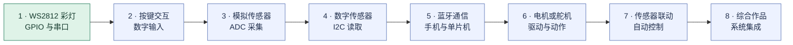
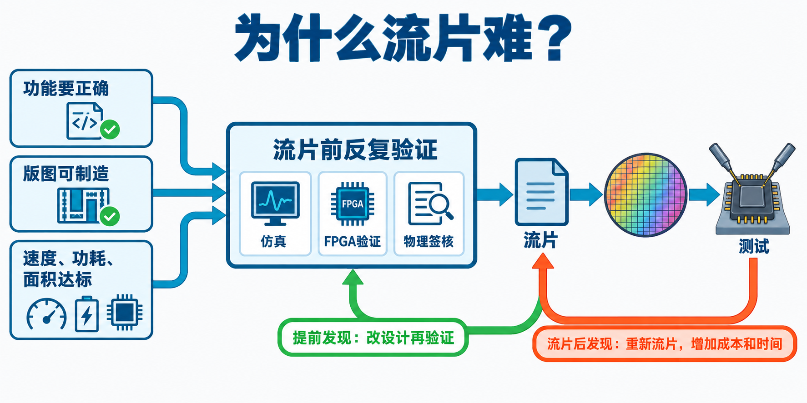

# 硬件入门与实验

这里先用概念图认识联网硬件的三个层面，再通过实验理解机器人、单片机、传感器和执行器如何协作。

## 硬件领域导览

- [硬件宏观认知思维导图](docs/硬件宏观认知思维导图.md)：从感知层、网络层和应用层理解硬件系统。

**感知层**通过传感器接触真实物理状态，并由单片机控制本地动作；**网络层**传送设备选择上报的数据和下发的命令；**应用层**查看收到的信息，再通过开放接口发出命令。电脑连上设备，不等于能直接看到所有电气和机械状态。

例如，手机收到 ESP32 上报的土壤湿度值，只能说明设备发送了这个读数；要确认传感器供电和接线，还需要相应的诊断信息或实际测量。

## 动手实验

- [ESP32 WS2812 RGB 灯实验](experiments/esp32-ws2812-lab/README.md)：基于老师提供的 `exp1_blink` 工程，使用 ESP32 控制灯并通过串口观察运行状态。

## 八个实验的学习路线

项目计划包含 8 个实验，从认识输入输出，到连接传感器、使用蓝牙，再完成综合作品。当前仓库已记录第 1 个 WS2812 灯实验；其余主题先作为学习路线规划，后续按实际实验内容补充。

第 1 个已记录；第 2–8 个为规划主题。

## 芯片知识

芯片设计需要同时满足功能、版图和性能约束。下图展示了流片前的验证关卡，以及流片后发现错误为什么会带来更长的返工周期。更多解释见[芯片从设计到流片](docs/芯片从设计到流片.md)。

## 行业与职业

- [硬件与软件：入行门槛和经验积累](docs/硬件与软件职业路径对比.md)：用对照图解释实体验证、迭代速度与经验价值的差异，并说明“35 岁毕业”不是软件的技术规律。

## 复盘

- [实验过程与踩坑记录](docs/esp32-ws2812-lab-retrospective.md)

当前 WS2812 示例没有读取土壤湿度传感器。智能农业湿度采集应作为后续实验，在确认传感器接线和 ADC 引脚后单独实现。
