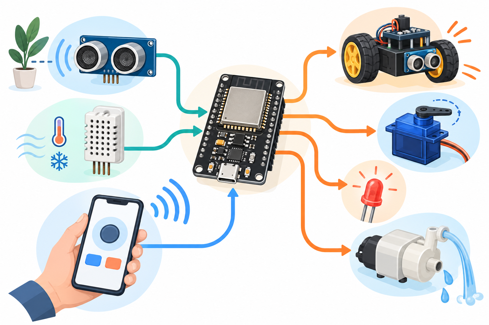
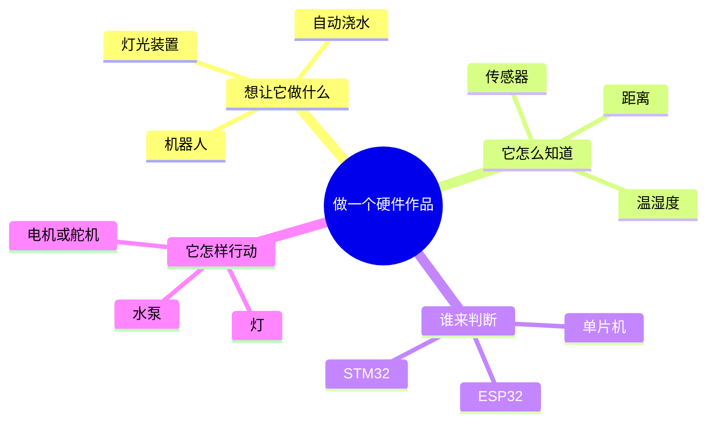
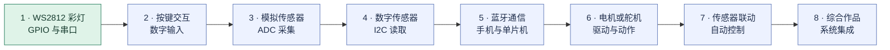

# 硬件入门与实验

这里先用思维导图认识硬件作品由什么组成，再通过实验逐步理解机器人、单片机、传感器和执行器如何协作。

## 硬件领域导览

- [硬件宏观认知思维导图](docs/硬件宏观认知思维导图.md)：从“想做什么、怎么感知、谁来判断、怎样行动”认识硬件作品。

把传感器、单片机和电机等部件接好并编写程序，就能做出会避障的小车；换成土壤传感器和水泵，就能做出自动浇水装置。

**理解硬件的一个关键区别：** 软件代理能检查的是它有权限访问的软件状态；硬件的物理状态不会自动暴露出来。电脑连接硬件后，只能读取设备通过串口、网络或传感器接口提供的信息。比如串口能显示 ESP32 发出的日志，但不能单凭日志确认传感器接线、供电或实际测量都正常。

## 动手实验

- [ESP32 WS2812 RGB 灯实验](experiments/esp32-ws2812-lab/README.md)：基于老师提供的 `exp1_blink` 工程，使用 ESP32 控制灯并通过串口观察运行状态。

## 八个实验的学习路线

项目计划包含 8 个实验，从认识输入输出，到连接传感器、使用蓝牙，再完成综合作品。当前仓库已记录第 1 个 WS2812 灯实验；其余主题先作为学习路线规划，后续按实际实验内容补充。

第 1 个已记录；第 2–8 个为规划主题。

## 芯片知识

硬件学习也会介绍芯片是什么、芯片怎样设计和制造，以及“流片”代表什么。先看[芯片从设计到流片](docs/芯片从设计到流片.md)。

## 复盘

- [实验过程与踩坑记录](docs/esp32-ws2812-lab-retrospective.md)

当前 WS2812 示例没有读取土壤湿度传感器。智能农业湿度采集应作为后续实验，在确认传感器接线和 ADC 引脚后单独实现。
