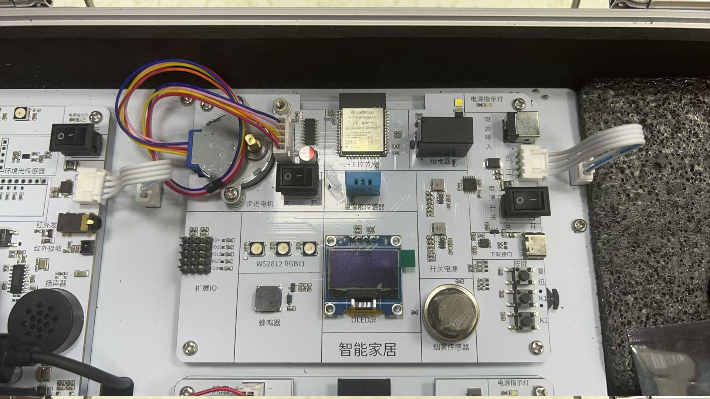
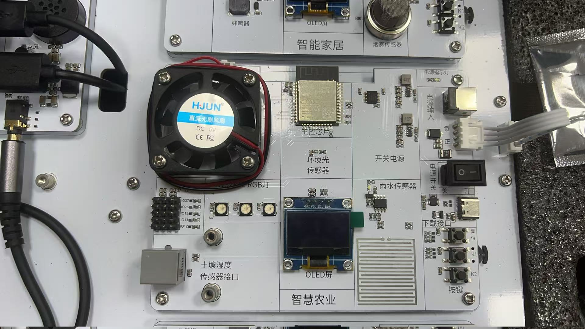
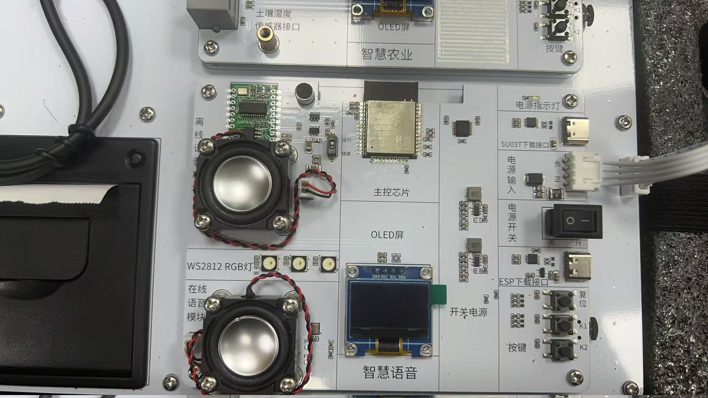
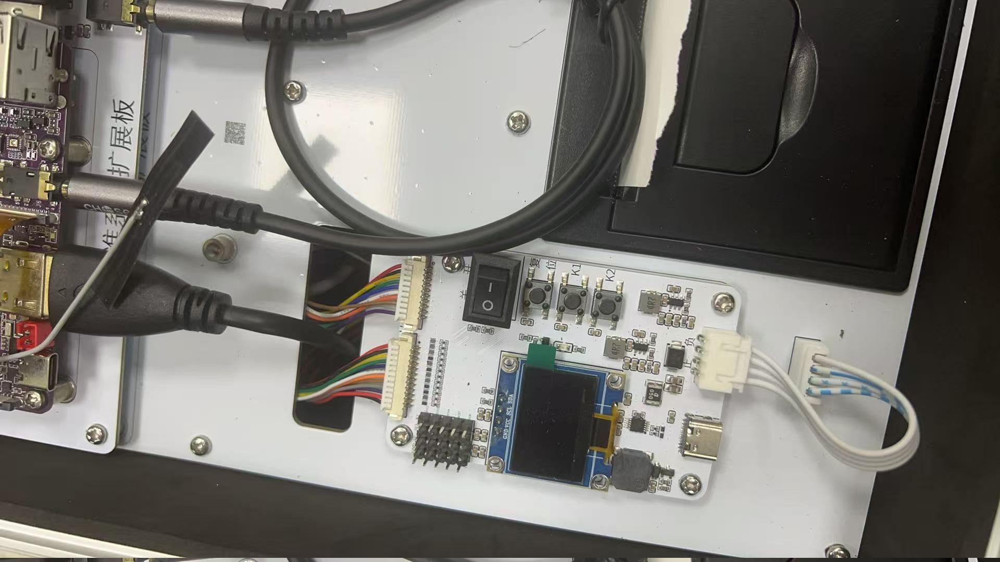
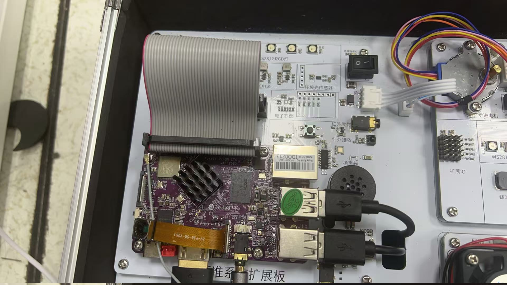

# 实训箱硬件与工程对照

这组照片记录本次实训箱的实物。照片中的器件名称已经印在电路板上；这里标明的是**仓库工程与哪块板对应**。图片仅将原照片转正，未重绘器件或添加重复的器件标注。

## 先看对应关系

| 实物照片 | 对应工程 | 目前能确认什么 |
| --- | --- | --- |
| [智能家居板](#智能家居板) | [3A 传感器](../experiments/exp3a_home/README.md)、[4A 执行器](../experiments/exp4a_home/README.md)、[8B RainMaker](../experiments/exp8b_rainmaker/README.md) | 板上可见 ESP32、温湿度、烟雾、OLED、蜂鸣器、步进电机与继电器区域；工程针对这些外设编写。 |
| [智慧农业板](#智慧农业板) | [3B 传感器](../experiments/exp3b_farm/README.md)、[4B 执行器](../experiments/exp4b_farm/README.md)、[8A MQTT 综合应用](../experiments/exp8a_mqtt/README.md) | 板上可见 ESP32、土壤湿度接口、环境光、雨水、OLED、风扇与 RGB 灯区域。8A 的风扇控制引脚与 4B 不同，烧录前需核对实际连接。 |
| [智慧语音板](#智慧语音板) | 暂无对应的语音工程 | 板上可见 ESP32、语音模块、扬声器与 OLED；仓库现有 13 个工程没有实现录音、语音识别或播报流程。 |
| [接口扩展板](#接口扩展板)、[主控及扩展区域](#主控及扩展区域) | 暂无已核实对应工程 | 照片可作为设备清单；型号、接口和与 ESP32 工程的关系还需核对。 |

阶段 1 的 [RGB 灯](../experiments/exp1_blink/README.md)与阶段 2 的[按键](../experiments/exp2_gpio_freertos/README.md)，在家居板、农业板上都有同类可见器件。阶段 5 的 [Wi-Fi/TCP](../experiments/exp5a_hardcode/README.md)与 [SmartConfig](../experiments/exp5b_smartconfig/README.md)、阶段 6 的 [BLE GATT](../experiments/exp6a_gatt/README.md)与 [BLE 配网](../experiments/exp6b_ble_prov/README.md)、阶段 7 的 [MQTT](../experiments/exp7_mqtt/README.md)主要使用 ESP32 通信能力，并非照片里另有一块专用“网络板”。具体接线仍以工程说明和实物核对为准。

## 智能家居板

对应 3A、4A 和 8B。3A 读取温湿度、烟雾并显示在 OLED；4A 控制蜂鸣器、步进电机、RGB 灯和继电器；8B 尝试将这些外设接入 RainMaker。这里的“对应”指工程目标与板上器件相符，**不代表这些功能已在照片中的实物上逐项验收**。

## 智慧农业板

对应 3B、4B 和 8A。3B 面向土壤湿度、环境光与雨水采集；4B 控制风扇与 RGB 灯。8A 上报的温湿度仍是模拟值，不能把照片中的传感器当作 8A 已采集真实数据的证据。4B 将风扇设为 GPIO21；8A 文档将风扇或继电器设为 GPIO17，实物烧录前应核对板卡版本与连接方式。

## 智慧语音板

这块板可以用于后续语音实验，但现有工程中没有对应的语音程序。照片上的“在线语音”和“离线语音”字样说明了板上的功能区域；仅凭照片不能确认模块型号、通信协议或实际可用功能。

## 接口扩展板

这张照片显示一块带 OLED、按键、排线接口和 USB 接口的扩展板。当前尚未核对它的型号和引脚定义，暂不把现有 ESP32 工程直接归到这块板上。

## 主控及扩展区域

照片中可见紫色主板、排线及相邻的白色扩展区域。紫色主板的芯片、系统和接口定义尚未核实；它不能仅凭外观被视作仓库里 ESP32 工程的运行板。

> 照片来自本次实训箱。图片只做方向旋转，保留原始照片像素；板上丝印是器件位置的第一手线索，型号、引脚与运行结果还需结合实物资料和烧录记录确认。
