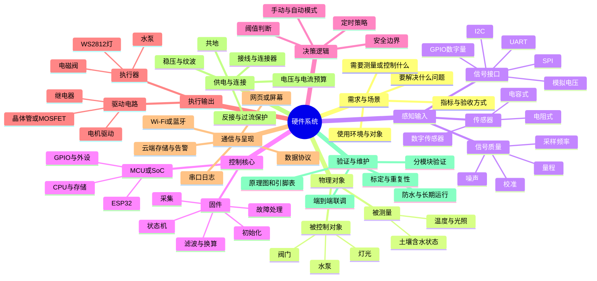

# 硬件宏观认知思维导图

> 从“现实问题”出发，沿着感知、处理、决策、执行和反馈看一套硬件系统。以 ESP32 智能农业为例，但这个框架也适用于机器人、智能家居和工业控制。



## 先建立系统链路

```text
真实环境
  → 传感器把物理量变成电信号
  → ESP32采样并换算
  → 固件按规则作出判断
  → 驱动电路控制灯/泵/阀
  → 串口、网页或屏幕呈现状态
  → 人或系统观察结果并调整
```

每一段都有自己的输入、输出和验证办法。USB 串口连上，只能证明通信链路可能建立；它不会自动产生传感器数据。固件没有读取传感器，网页就没有湿度可显示；传感器读数存在但协议不匹配，网页也可能解析不到。

## 对照当前 ESP32 实验

- 当前 WS2812 实验覆盖：ESP32 固件、SPI 输出、RGB 灯执行器、串口日志。
- 当前实验没有覆盖：土壤湿度传感器、ADC 采样、湿度校准、灌溉决策、水泵驱动和网页数据协议。
- 智能农业可按小步扩展：**先读 ADC 原始值 → 做干湿校准 → 串口输出湿度 → 网页显示 → 最后才加泵和自动控制**。

## 设计时优先问的六个问题

1. 要测量/控制的物理量是什么，目标和验收条件是什么？
2. 选的传感器输出什么信号，范围和供电要求是什么？
3. ESP32 哪个引脚或总线与它相连，电平是否兼容？
4. 固件何时采样，如何滤波、校准、换算和处理异常？
5. 数据经什么协议到串口、网页或云端，接收端如何验证？
6. 执行器需要多大电流，是否要独立供电、驱动和保护？
