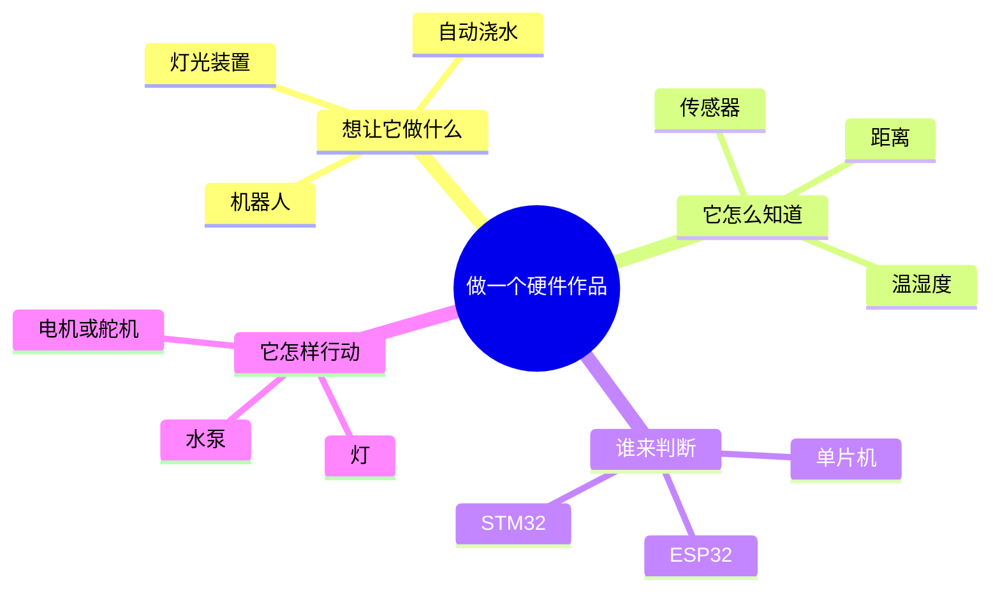
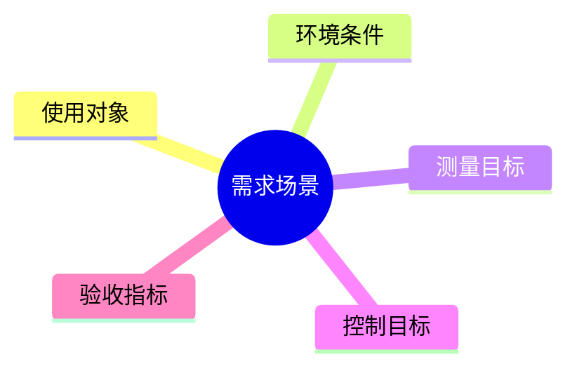
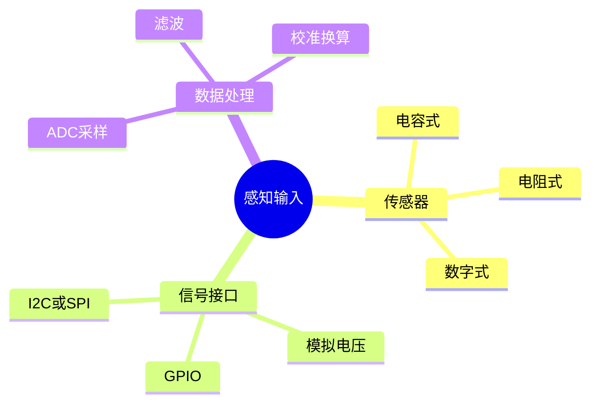
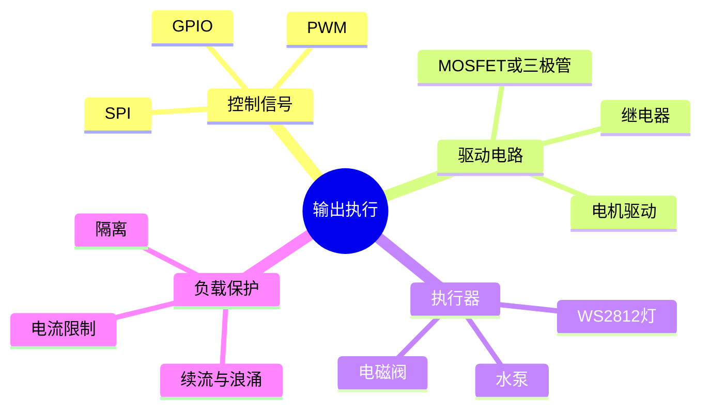
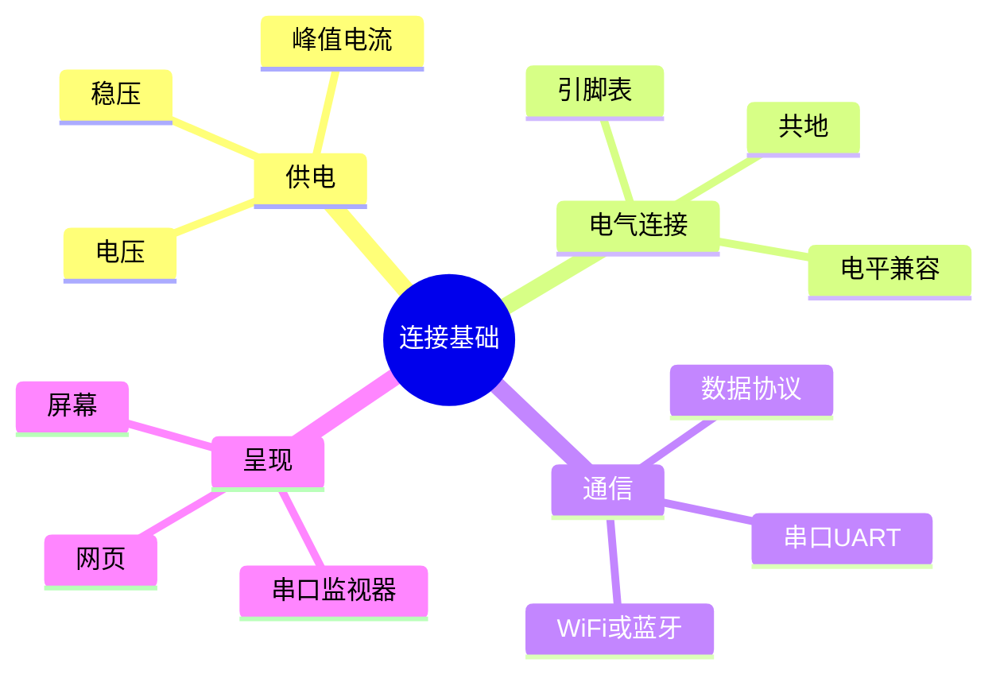
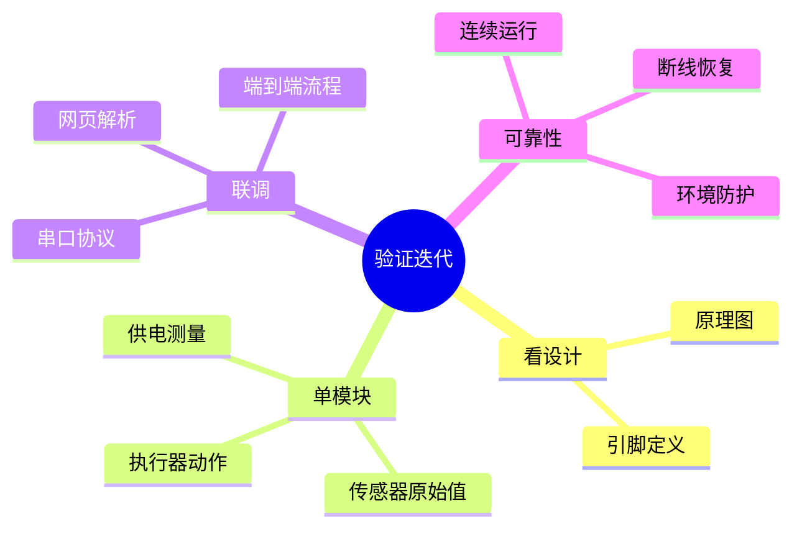

# 硬件是什么：领域与系统导览

先从一个作品怎么工作来认识硬件：它要做什么、怎么感知、谁来判断、最后怎样行动。机器人是由这些部分组合起来的作品，单片机则常常负责其中的判断与控制。

## 一张图认识硬件



把传感器、单片机和电机等部件接好并编写程序，就能做出会避障的小车；换成土壤传感器和水泵，就能做出自动浇水装置。供电、接线和通信是让这些部分协作的基础。

## 一套硬件系统怎样工作

不同设备虽然用途各异，常见工作链路可以概括为：

```text
需求与环境 → 传感器 → 控制器与固件 → 驱动与执行器 → 结果反馈
                         ↕
                   通信与界面
```

## 模块一：需求场景

先说清楚系统要解决的问题，以及怎样算完成。



**智能农业例子：** 测量盆土含水变化；低于设定范围时提示或浇水；用干土、湿土和阈值触发结果验收。

## 模块二：感知输入

传感器把温度、湿度、光照等物理量转换成控制器能够读取的信号。



**要核实：** 传感器供电、输出电压范围、接线引脚、采样方式和干湿校准值。传感器接上了，不代表固件已经读取它。

## 模块三：计算控制

控制器读取输入、运行固件逻辑，再决定是否改变输出。

```mermaid
mindmap
  root((计算控制))
    控制器
      ESP32
      GPIO与外设
      存储与任务
    固件流程
      初始化
      周期采样
      数据换算
      状态判断
    控制策略
      阈值
      定时
      手动自动模式
    异常处理
      传感器断线
      越界读数
      安全停止
```



**当前实验对应：** ESP32 运行 `exp1_blink` 固件，初始化 SPI 并循环输出颜色状态；当前程序没有 ADC 采样或湿度判断。

## 模块四：输出执行

控制器的引脚通常不能直接带动大功率负载，需要驱动电路连接执行器。



**当前实验对应：** WS2812 灯条是执行器，SPI 数据用于控制颜色。若加水泵，需要另行设计驱动和供电，不能把水泵直接接到 ESP32 GPIO。

## 模块五：连接基础

供电、接线和通信协议决定模块能不能稳定协同。



**排错提示：** USB 串口已连接只说明电脑和板子的串口链路可用，不会自动生成湿度数据。网页只有收到并识别固件发送的数据，才能显示对应读数。

## 模块六：验证迭代

按层验证能更快定位问题，不要一开始就把传感器、执行器、网页和云端同时联调。



## 用这张图规划智能农业项目

建议按顺序扩展，每一步都有独立可见的结果：

1. 确认土壤湿度传感器型号、输出范围和 ESP32 ADC 引脚。
2. 只做 ADC 读取，在串口观察干土、湿土的原始值变化。
3. 用实测干湿值校准，再输出湿度百分比。
4. 约定串口或 Wi-Fi 数据格式，再让网页显示读数。
5. 最后加阈值判断、驱动模块和水泵，并验证断线与停止条件。

当前 WS2812 实验已经覆盖“计算控制、输出执行、串口观察”的一小段；湿度传感器采集和自动灌溉属于后续模块。详细过程与踩坑见[实验复盘](esp32-ws2812-lab-retrospective.md)。
