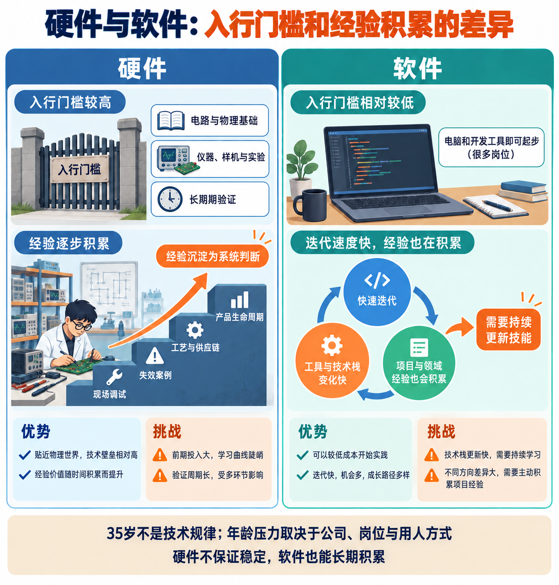
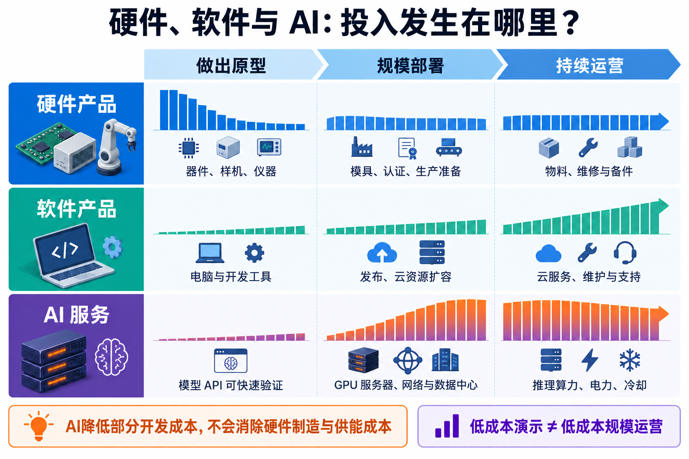
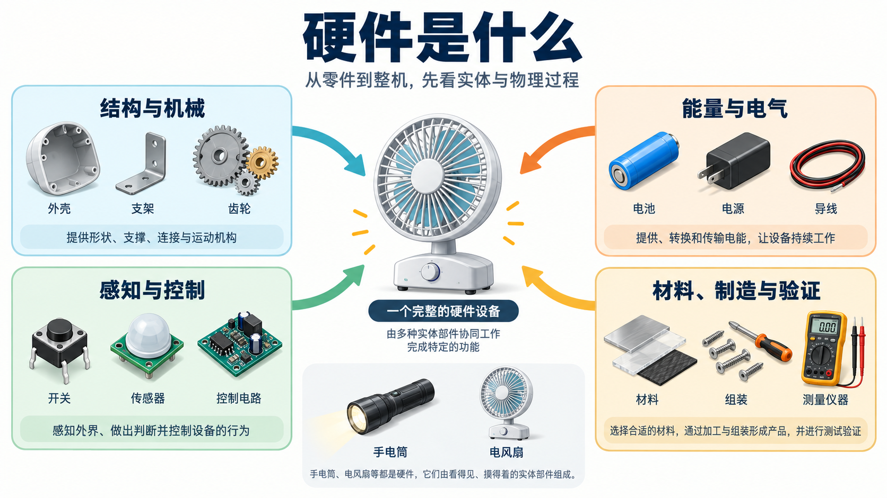
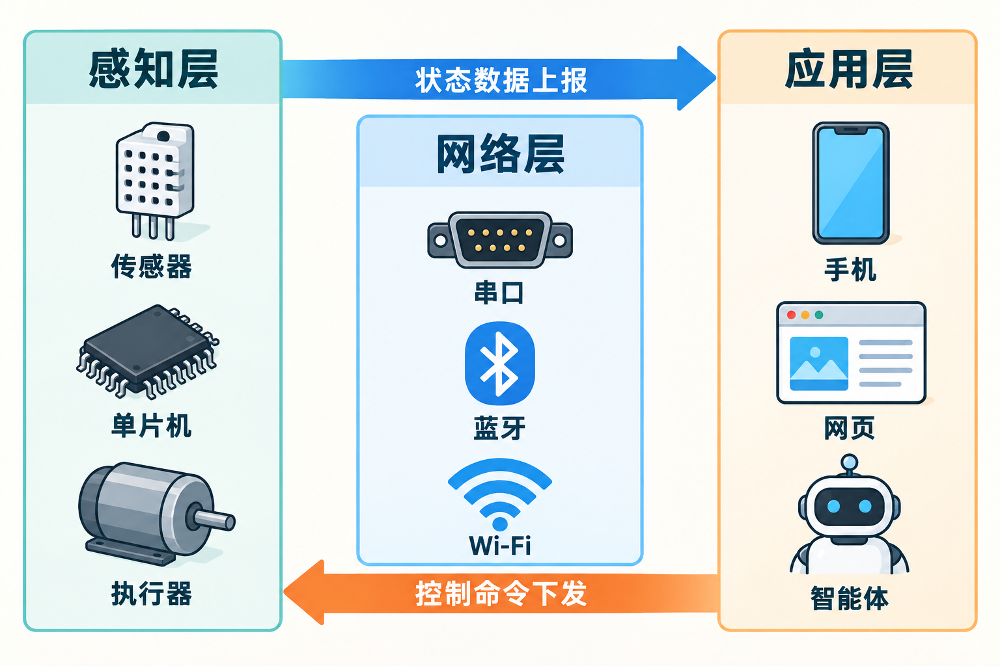
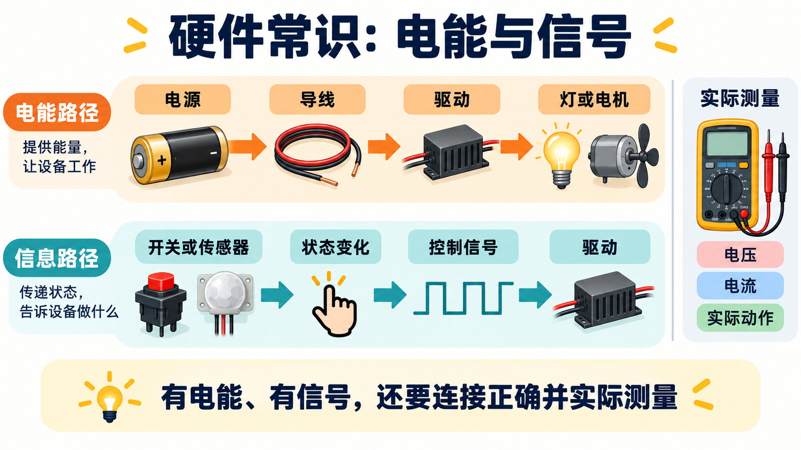
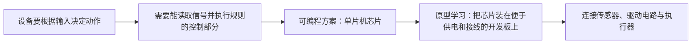
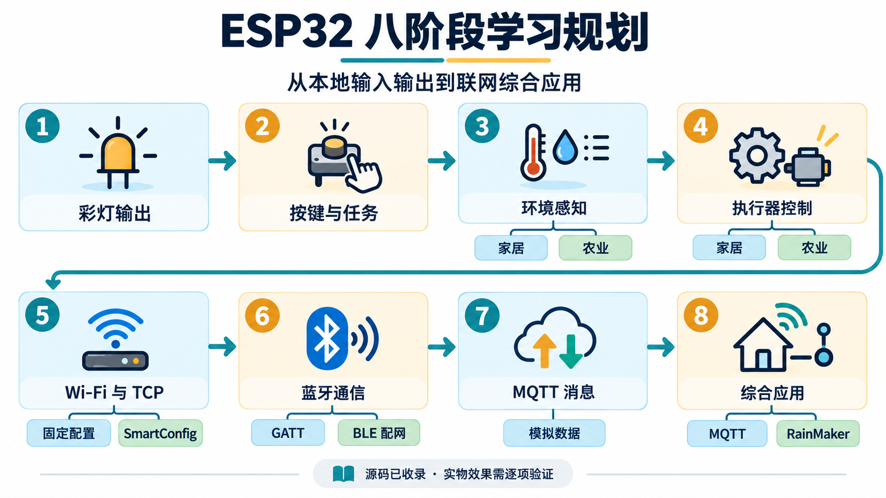

# 硬件认知篇：先比较硬件与软件，再学硬件常识

第一部分从就业视角认识硬件：把它和软件放在一起，比较工作对象、反馈周期、入门方式和经验积累。第二部分再解释硬件是什么、设备怎样工作，以及设备中的控制功能如何连接到芯片与开发板。

## 第一部分：硬件与软件的宏观比较

### 一、两类工作分别在交付什么



做一台电风扇，硬件工作要让供电、电机、扇叶和结构在真实环境里协同；给它做手机控制软件，则要处理界面、数据、命令与设备通信。一个产品可能同时需要两类工作，岗位边界会随团队而变化。

| 比较角度 | 硬件工作常见情形 | 软件工作常见情形 |
| --- | --- | --- |
| 工作对象 | 器件、电路、机械结构与整机 | 程序、数据和运行中的系统 |
| 交付与验证 | 样机、图纸、测量记录、实物测试 | 代码、测试结果、可运行服务或应用 |
| 修改与反馈 | 可能受器件采购、加工、装配和测试周期影响 | 通常能更快构建、修改和发布原型 |
| 长期经验 | 失效分析、跨环节调试、制造与现场问题 | 系统设计、领域知识、安全与长期维护 |

这是工作方式的比较，不是说所有硬件岗位都慢、所有软件岗位都快。硬件设计也使用软件工具；软件系统也依赖实体服务器和网络设备。详见[硬件与软件：入行门槛和经验积累](硬件与软件职业路径对比.md)。

### 二、从就业角度怎样理解差异



硬件原型通常较早需要器件、样机和测量条件，走向批量交付还会遇到制造、测试与供应链；软件原型往往可以先在电脑上做出，但上线后仍有研发、运维和云服务成本。投入发生在不同阶段，影响团队的项目节奏，也影响新人能接触到的工作。[投入结构专题](硬件软件与AI时代的投入结构.md)有进一步比较。

选方向时，可以看三件具体的事：自己更愿意处理什么对象；希望通过代码运行、仪器测量还是实物交付获得反馈；准备积累哪类可迁移的能力。**入行门槛高不保证职业稳定，工具变化快也不等于经验没有价值。**岗位、公司和产品阶段仍会改变实际工作。这个仓库的 ESP32 实操偏向嵌入式固件与设备联调，可以作为体验硬件软件交界处的一个小入口。

## 第二部分：硬件基础常识

### 三、硬件是什么



硬件是实现功能的实体部件和设备。外壳、支架、齿轮、导线、电池、电机、传感器、电路板都属于硬件。它们占空间、承受力、消耗或传递能量，也会受到温度、磨损、干扰和制造误差的影响。

| 设备 | 主要部件 | 怎样产生结果 |
| --- | --- | --- |
| 手电筒 | 外壳、电池、开关、导线、灯 | 电池供电，开关闭合，灯发光 |
| 电风扇 | 支架、电源、开关、电机、扇叶 | 电能驱动电机，扇叶推动空气 |

这些设备不需要开发板也能完成任务。给风扇增加温度传感器和控制电路，可以让它根据温度动作；再加通信模块，才可能用手机查看或控制。面对一件硬件，先问结构如何承载、能量从哪里来、输入怎样变成输出，以及怎样制造和验证。[领域与系统导览](硬件宏观认知思维导图.md)把这些问题进一步拆开。

### 四、一套电子设备怎样工作



电子设备通常要把**供电、输入、处理、输出**连成一条链；联网只是可选的延伸。以盆土监测为例：

```text
土壤状态 → 传感器信号 → 控制器读取与处理 → 灯、继电器或电机动作
                                  ↕
                         可选的通信与手机界面
```

传感器把物理状态变成电信号，控制部分根据收到的信号决定是否让灯或电机动作。简单设备可以用开关或固定功能的电路完成控制；需要按程序判断、记录数据或联网时，常会使用单片机。若加上 Wi-Fi 或蓝牙，应用才能收到设备选择上报的数据并发回命令。**手机显示了湿度值，只能说明它收到了这个值**。供电、接线和测量准确性还需结合原理图、日志、原始采样值与实物测量确认。[实验 3B](../experiments/exp3b_farm/README.md)练习土壤、光照和雨滴采集。

### 五、设备中的控制功能怎样连接到芯片



接着上一章的盆土监测设备看：传感器输出的是电信号，灯或电机需要电能才能动作。中间的控制部分要接收信号、作出判断，再让驱动电路接通或调节给执行器的电能。**信号告诉设备“该做什么”，供电让设备“有能力做”。**没有正确连接和实际测量，程序界面显示正常也不能证明实物动作正常。

控制部分并不总要使用芯片：手电筒的机械开关就能直接控制灯。若要根据传感器读数判断、改变动作规则，或与手机通信，使用可编程的**单片机**就更合适。单片机是一类把处理器、存储和常用外设集成在一起的芯片；芯片则是把电路集成在半导体材料上的器件。



本仓库的 ESP32 是单片机产品，ESP32 开发板则把芯片和供电、烧录、接口等部件组合起来，方便接传感器和编写固件。**设备提出控制需求 → 选择单片机 → 借助开发板验证设备**，这就是从第四章走到芯片与开发板的关系。若想继续理解芯片本身如何设计、制造和流片，再阅读[芯片从设计到流片](芯片从设计到流片.md)。

### 六、怎样从常识走到动手验证



本仓库用八个阶段练习设备能力：先确认输出和本地输入，再采集环境、控制执行器，之后加入 Wi-Fi、蓝牙、MQTT 与综合应用。每加一层，都应先看到该层独立的结果，减少整套系统联调时的定位难度。

| 阶段 | 先确认什么 |
| --- | --- |
| 彩灯与按键 | 固件运行、引脚响应、串口日志 |
| 传感器与执行器 | 原始读数随环境变化，动作符合控制信号 |
| 网络与消息 | 配网、上报、断线恢复和命令响应 |
| 综合应用 | 数据、控制与界面连成完整链路 |

这是一条学习顺序，不代表所有工程都已通过设备验收。第 5、7、8A 阶段的温湿度数据为模拟值；构建产物不能替代接线、烧录和现场观察。具体工程见[实操总览](../README.md#第一部分实操)。

## 按需深读

- [硬件与软件：入行门槛和经验积累](硬件与软件职业路径对比.md)
- [硬件、软件与 AI：投入发生在哪里](硬件软件与AI时代的投入结构.md)
- [硬件是什么：领域与系统导览](硬件宏观认知思维导图.md)
- [芯片从设计到流片](芯片从设计到流片.md)
