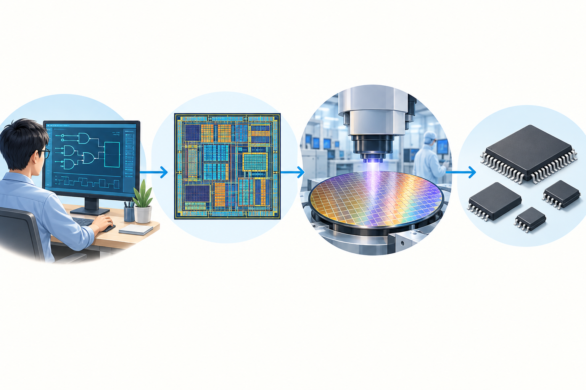
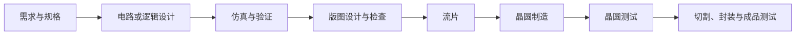

# 芯片从设计到流片

## 芯片是什么

芯片是把许多电子元件和连接线路集成在一小块半导体材料上的电路。它可以负责计算、存储、通信、供电管理或读取传感器信号。常见类型包括处理器、存储芯片、传感器芯片和单片机。

单片机（MCU）是一类把处理器核心、存储器和常用外设集成在一起的芯片。ESP32、STM32 都有相应的 MCU 产品。我们实验时接触到的开发板则通常还包含电路板、电源、USB 转串口等部件；它和芯片本身不是同一个东西。

## 一颗芯片怎样诞生

数字芯片设计常从 RTL（寄存器传输级描述）开始，经综合和布局布线形成物理版图。设计团队需要在制造前反复仿真、验证并检查版图；送交制造的数据确定后，晶圆厂按相应工艺制造芯片。晶圆上完成的芯片还要经过测试、切割和封装，成为可安装和使用的成品。

## 什么是流片

“流片”（tape-out）指芯片设计完成签核后，把最终版图数据交给晶圆厂进入制造的关键节点。如今交付的是电子设计数据，不是把磁带真的寄给工厂。流片之后才会制造出真实硅片，因此设计中的问题可能要等芯片回来后才能发现；若需要修正并再次制造，通常称为重新流片（re-spin）。

流片不等于芯片已经做完或验证成功。它表示设计进入制造阶段；后面仍有晶圆制造、晶圆测试、封装和成品测试。

## 为什么流片难

难点不是把设计文件交出去，而是在制造前证明设计足够可靠。主要有三类问题：

1. **功能要正确。** 芯片要处理大量输入、状态和边界情况。仿真、形式验证和 FPGA 原型可以从不同角度找问题，但不能穷尽所有真实使用情形。
2. **版图要可制造。** 逻辑正确还不够，晶体管和连线必须按晶圆厂工艺规则放进有限面积。设计规则检查（DRC）检查几何规则，版图与电路图一致性检查（LVS）检查版图是否实现了预期电路。
3. **性能和实现要同时达标。** 连线会带来延迟和功耗；时钟、供电、面积、散热和不同模块之间的接口都可能互相影响。改一处设计后，相关验证常要重新执行。

所以流片前要经过多轮功能验证和物理签核。流片后如果发现硅片问题，通常需要修改设计并再制造一版；这会增加费用和等待时间。流片前也不是能证明“绝对没有错误”，而是通过系统化检查把风险降到可以接受的程度。

## 和当前实验的关系

使用 ESP32 开发板是在使用已经设计、制造和封装好的芯片。当前 WS2812 实验是在编写和运行固件，并没有设计 ESP32 芯片本身，也没有进行流片。可以把两条工作看作不同层次：

- **芯片设计与制造：** 设计电路和版图，把设计交给晶圆厂制造。
- **嵌入式开发：** 使用现成芯片，通过固件、传感器和执行器实现功能。

## 延伸阅读

- [Cadence：ASIC Prototyping](https://www.cadence.com/en_US/home/explore/what-is-asic-prototyping.html)：介绍 ASIC 设计验证、原型验证与流片的关系。
- [TSMC 2024 年报](https://investor.tsmc.com/static/annualReports/2024/english/ebook/files/basic-html/page101.html)：介绍晶圆制造相关的光刻、掩模和先进封装技术。
- [Synopsys：集成电路设计流程](https://www.synopsys.com/glossary/what-is-ic-design.html)：介绍逻辑实现、物理验证和签核。
- [Synopsys：IP 集成与流片实践](https://www.synopsys.com/articles/guidelines-for-integration.html)：说明多来源设计数据、物理检查和流片前一致性验证的挑战。
